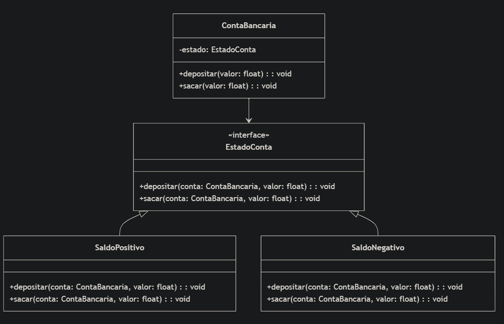
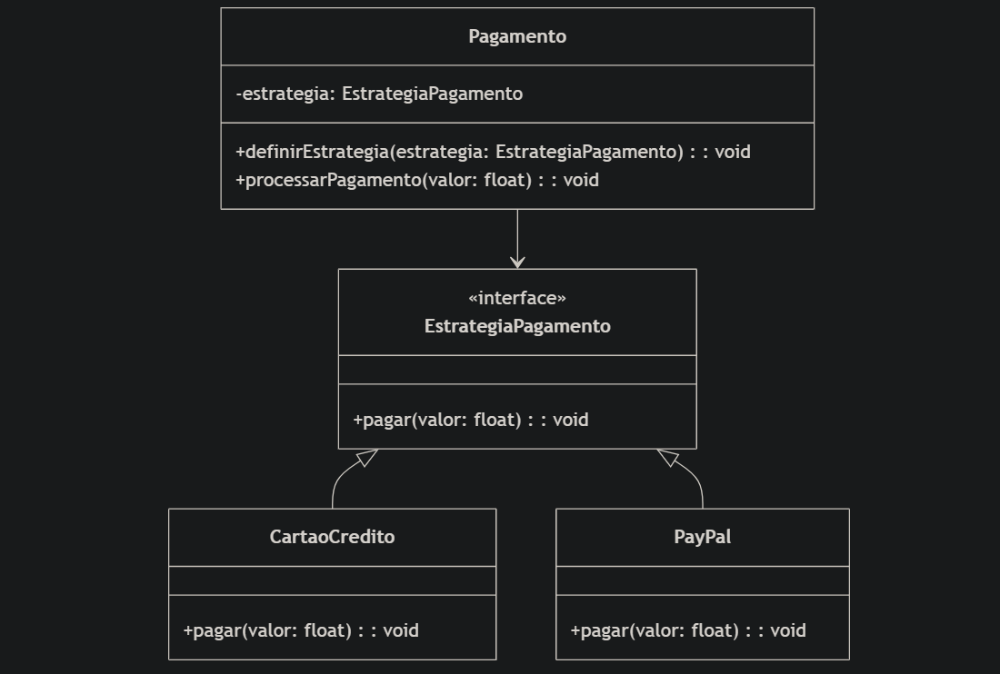

# Execução
Certifique-se que está no diretorio ``02-exercicio-facade`` antes de executar o código.

Exeute o comando: ``node index.js``
# Descrição do Problema:
Imagine que você está desenvolvendo um sistema de reserva de viagens online. Este sistema possui várias partes complexas, como reserva de voos, reserva de hotéis e aluguel de carros. Cada uma dessas partes possui sua própria lógica e interações com serviços externos.

Para simplificar a interação do cliente com o sistema, você decidiu usar o padrão de design Facade. Sua tarefa é criar uma classe TravelFacade que irá fornecer uma interface simplificada para o cliente, encapsulando toda a complexidade do processo de reserva de viagens.

## Solução:
- Modele as diferentes partes do sistema de reserva de viagens (reserva de voos, reserva de hotéis, aluguel de carros, etc.).
- Implemente as classes necessárias para cada uma dessas partes.
- Crie a classe TravelFacade que irá encapsular a interação com todas as partes do sistema.
- Teste o sistema, mostrando como um cliente pode usar a TravelFacade para fazer uma reserva de viagem completa de forma simples, sem precisar conhecer os detalhes internos do sistema.
 
# Crie um exemplo de modelagem que represente a diferença entre os padrões comportamentais State e Strategy:
## Padrão State:
O comportamento do objeto muda de acordo com seu estado interno. Cada estado tem sua própria implementação do comportamento.

Exemplo de uma ``conta bancária``, que pode estar em diferentes estados como ``SaldoPositivo`` ou ``SaldoNegativo``.

## Padrão Strategy:
O comportamento do objeto é configurado externamente. Diferentes estratégias podem ser aplicadas dinamicamente.

Exemplo de um sistema de ``pagamento`` que pode usar diferentes estratégias de pagamento como ``CartaoCredito`` ou ``PayPal``.
