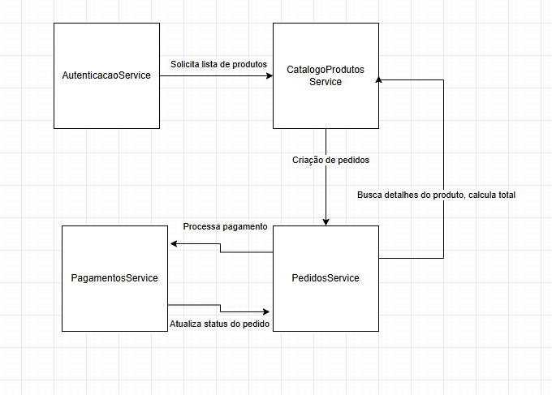

# Simulação de Arquitetura de Microsserviços para Sistema de Gerenciamento de Pedidos

Este projeto simula uma arquitetura de microsserviços para um sistema de gerenciamento de pedidos. A comunicação entre os serviços é simulada localmente, utilizando métodos e objetos.

## Descrição do Sistema

O sistema é composto por quatro microsserviços principais:

-   **Serviço de Autenticação:** Gerencia o login dos usuários e autentica os acessos ao sistema.
-   **Serviço de Catálogo de Produtos:** Gerencia os dados dos produtos, como nome, preço e estoque.
-   **Serviço de Pedidos:** Gerencia a criação de pedidos, associando usuários aos itens comprados e calculando o total da compra.
-   **Serviço de Pagamentos:** Processa os pagamentos de pedidos e altera o estado do pedido para "pago" ou "pendente".

## Estrutura do Projeto

O projeto contém os seguintes arquivos:

-   `AutenticacaoService.js`: Implementa o serviço de autenticação.
-   `CatalogoProdutosService.js`: Implementa o serviço de catálogo de produtos.
-   `PedidosService.js`: Implementa o serviço de pedidos.
-   `PagamentosService.js`: Implementa o serviço de pagamentos.
-   `index.js`: Simula o fluxo principal do sistema, criando instâncias dos serviços e chamando seus métodos.

### Fluxo
1. O Serviço de Autenticação é o ponto de entrada, onde o usuário faz login.
2. Após o login, o usuário interage com o Serviço de Catálogo de Produtos para visualizar os produtos.
3. Ao selecionar os produtos, o Serviço de Pedidos é acionado para criar um novo pedido.
4. O Serviço de Pedidos utiliza o Serviço de Catálogo de Produtos para obter informações sobre os produtos e calcular o total do pedido.
5. O Serviço de Pagamentos processa o pagamento do pedido e notifica o Serviço de Pedidos sobre o status do pagamento.

## Como Executar

Para executar a simulação, execute o seguinte comando:

```
node index.js
```

Este comando irá simular o fluxo de um usuário fazendo login, visualizando o catálogo de produtos, criando um pedido e processando o pagamento. Os logs no console irão demonstrar a interação entre os serviços.

## Simulação de Falhas

O sistema inclui uma simulação de falhas. Por exemplo, o pagamento pode falhar por saldo insuficiente.

## Diagrama de Interação entre os Microsserviços


```
[Autenticação] --> [Catálogo de Produtos] : Solicita Lista de Produtos
[Catálogo de Produtos] --> [Pedidos] : Criação de Pedido
[Pedidos] --> [Catálogo de Produtos] : Busca Detalhes do Produto, Calcula Total
[Pedidos] --> [Pagamentos] : Processa Pagamento
[Pagamentos] --> [Pedidos] : Atualiza Status do Pedido
```
