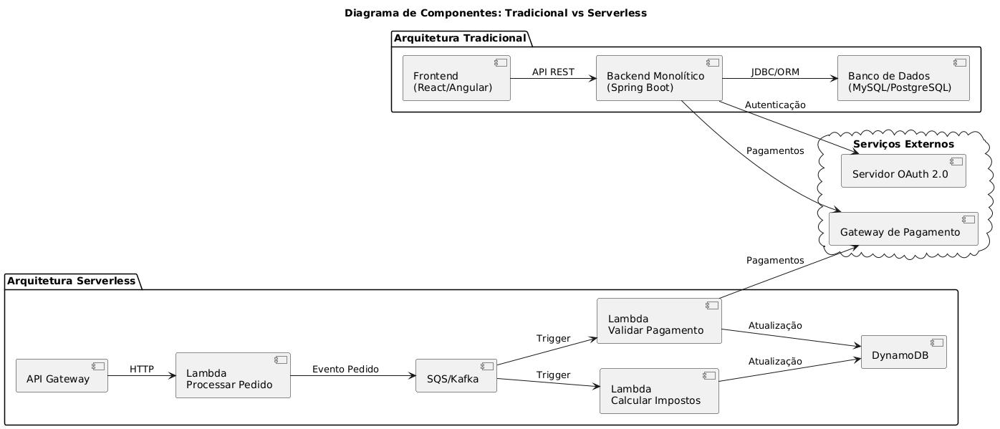
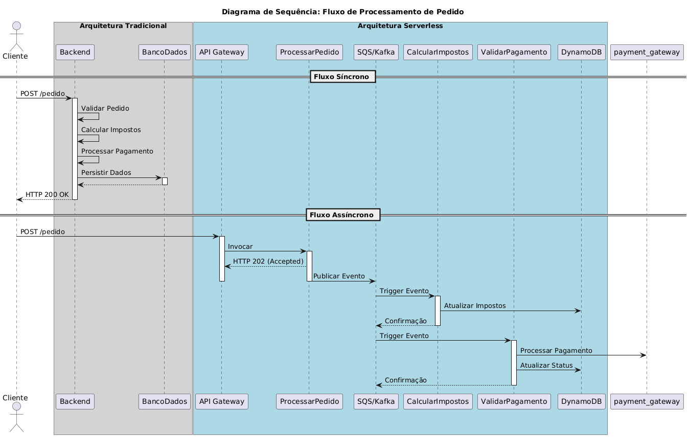
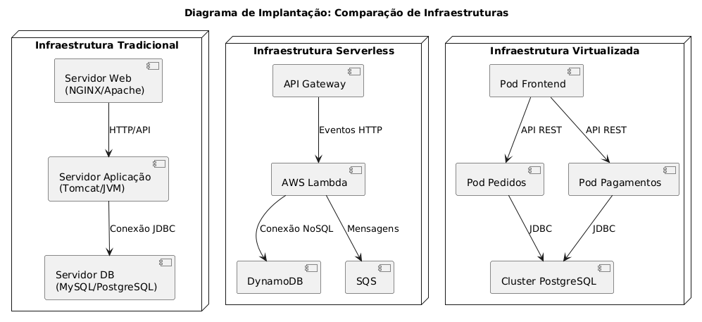

# Atividade Lista - Virtualização e Containers
[Descrição da atividade de lista sobre virtualização e containers.](descricao-atividade.md)

# Diagramas
## Diagrama de Componentes: Tradicional vs Serverless

## Diagrama de Sequência: Fluxo de Processamento de Pedido

## Diagrama de Implantação: Comparação de Infraestruturas

# Documentação de Transição para Arquitetura Serverless

Esta documentação descreve a migração de uma aplicação tradicional multicamadas para uma arquitetura serverless, utilizando diagramas UML para ilustrar a evolução do sistema.

---

## Visão Geral da Arquitetura

### Arquitetura Tradicional (3 Camadas)
- **Camada de Apresentação**: Frontend em React/Angular.
- **Camada de Negócio**: Backend monolítico em Spring Boot (Java).
- **Camada de Dados**: Banco de dados relacional (MySQL/PostgreSQL).
- **Serviços Externos**: Autenticação OAuth 2.0 e gateway de pagamento.

### Arquitetura Serverless Proposta
- **API Gateway**: Gerencia requisições HTTP.
- **Funções Serverless (FaaS)**: AWS Lambda ou Google Cloud Functions.
- **Banco de Dados Serverless**: DynamoDB ou Firestore.
- **Comunicação Assíncrona**: Filas SQS/Kafka para eventos.
- **Autenticação Gerenciada**: AWS Cognito ou Auth0.

---

## Objetivos da Transição
1. **Desacoplamento**: Dividir o backend monolítico em funções independentes.
2. **Escalabilidade Automática**: Recursos sob demanda (ex: AWS Lambda).
3. **Redução de Custos**: Pagamento apenas pelo uso efetivo.
4. **Resiliência**: Tolerância a falhas via processamento assíncrono.

## Diagrama de Componentes: Tradicional vs Serverless
Este diagrama compara duas arquiteturas distintas:
- **Arquitetura Tradicional:** Utiliza um frontend desenvolvido em React ou Angular, um backend monolítico em Spring Boot e um banco de dados relacional como MySQL ou PostgreSQL. O backend interage com serviços externos, como um servidor OAuth 2.0 para autenticação e um gateway de pagamento.
- **Arquitetura Serverless:** Baseia-se em componentes gerenciados, como API Gateway, funções AWS Lambda para processar pedidos, calcular impostos e validar pagamentos, além do banco de dados NoSQL DynamoDB e de um barramento de eventos como SQS ou Kafka.

---

## Diagrama de Sequência: Fluxo de Processamento de Pedido
Este diagrama ilustra o fluxo de processamento de um pedido em duas arquiteturas:
- **Arquitetura Tradicional:** O fluxo é síncrono, onde o cliente envia um pedido para o backend, que valida, calcula impostos, processa o pagamento e persiste os dados no banco antes de retornar uma resposta ao cliente.
- **Arquitetura Serverless:** O fluxo é assíncrono, começando com o API Gateway invocando uma função Lambda que publica um evento no barramento de mensagens. Outras funções Lambda são acionadas para calcular impostos, validar pagamentos e atualizar o banco de dados DynamoDB.

---

## Diagrama de Implantação: Comparação de Infraestruturas
Este diagrama apresenta três tipos de infraestruturas:
- **Infraestrutura Tradicional:** Inclui um servidor web (NGINX/Apache), um servidor de aplicação (Tomcat/JVM) e um servidor de banco de dados (MySQL/PostgreSQL).
- **Infraestrutura Serverless:** Utiliza API Gateway, funções AWS Lambda, DynamoDB e SQS, removendo a necessidade de gerenciamento de servidores.
- **Infraestrutura Virtualizada:** Baseia-se em pods dentro de um cluster Kubernetes, com pods separados para frontend, pedidos e pagamentos, e um cluster PostgreSQL para persistência de dados.